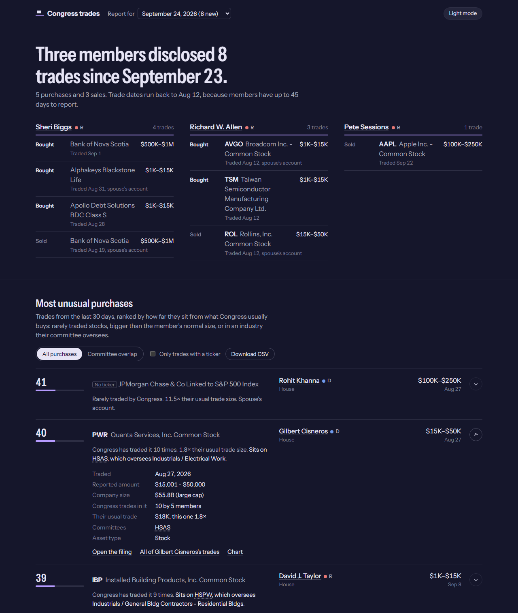

<div align="center">

# Congress Trades

**Which stock trades by members of Congress are actually unusual?**

Pulls every stock trade members disclose straight from the House and Senate, scores each one for how far it sits from normal congressional trading, and publishes a daily briefing of what's new.


[How it works](#how-it-works) · [Quick start](#quick-start) · [Scoring](docs/SCORING.md) · [CLI](docs/CLI.md) · [OCR](docs/OCR.md) · [Publishing](docs/PUBLISHING.md)



</div>

## How it works

Members of Congress must report stock trades within 45 days (the STOCK Act). This tool collects those reports, adds company and committee context, and ranks each purchase on a 0–100 scale. A trade scores higher when it is a stock Congress rarely touches, it is much bigger than the member's usual trade, the member sits on a committee that oversees the company's industry, it is a small company, an option, or it went through a spouse's or child's account. [Scoring](docs/SCORING.md) has the full formula.

Each run produces a static site: a report that opens with what was disclosed since the previous run, the most unusual purchases of the last 30 days with the reasons written out, every trade on file, and a page per member and per party.

### Where the data comes from

Everything is public and free. There are no paid APIs.

| What | Source | How |
|---|---|---|
| House trades | [House Clerk](https://disclosures-clerk.house.gov/) | Downloads the yearly filing index, then each periodic transaction report (PTR) PDF, which it decrypts and parses directly |
| Senate trades | [Senate eFD](https://efdsearch.senate.gov/) | Reads each electronic PTR page |
| Scanned paper filings | Same two sites | Renders pages with [MuPDF](https://mupdf.com/) and reads them with a local vision model on [Ollama](https://ollama.com) (`qwen3.6:27b` by default). Optional. See [OCR](docs/OCR.md) |
| Company size and industry | [SEC EDGAR](https://www.sec.gov/edgar) | Ticker to company lookup, SIC code mapped to a sector, public float as the market cap |
| Members, parties, committees | [unitedstates/congress-legislators](https://github.com/unitedstates/congress-legislators) | Current legislators and committee membership |
| Which committee oversees what | This repo | A hand-built map from each committee to the sectors and industries it oversees (`src/data/committee-sector-taxonomy.ts`) |
| Charts | [TradingView](https://www.tradingview.com/) | Links only |

[Financial Modeling Prep](https://financialmodelingprep.com/) can stand in for the government and EDGAR sources with `DATA_SOURCE=fmp` and an API key.

Hosting is optional. The site is plain HTML files. The repo includes a CloudFormation template for S3 and CloudFront, and a Windows task and Docker setup for daily runs. See [Publishing](docs/PUBLISHING.md).

## Quick start

You need Node.js 22.

```bash
npm install
npm run build
echo 'SEC_USER_AGENT="Your Name you@example.com"' > .env   # the SEC requires a contact in the User-Agent
node --env-file=.env dist/index.js report:html
```

The first run downloads a year of filings, so it takes a while. Later runs only fetch what's new. Open `output/web/index.html`, which forwards to the newest report.

Add `--publish` to upload the site to S3, or skip OCR with `--no-ocr` if you don't run Ollama. For the terminal instead of a web page, `node dist/index.js analyze` prints the top-scoring trades. [CLI](docs/CLI.md) lists every command.

## The report

- **New since the last report.** Filings arrive weeks after the trade, so they would otherwise sit mid-table. They're grouped by member at the top and marked in the tables.
- **Most unusual purchases.** Ranked by score, each with its reasons ("11.5× their usual trade size. Spouse's account.") and details such as company size and the member's committees. Switch to trades that overlap the member's committees, hide assets with no ticker, or download a CSV.
- **Every trade**, with pages per member and per party, and an archive of past reports.
- A palette picker and light and dark modes.

## Docs

- [Scoring](docs/SCORING.md): the six factors, their weights and thresholds
- [CLI](docs/CLI.md): every command, options, and what's cached where
- [OCR](docs/OCR.md): reading scanned paper filings, accuracy, and the catch-up command
- [Publishing](docs/PUBLISHING.md): AWS hosting, scheduled runs, and Docker
- [Sector and industry mapping](docs/sector-industry-mapping.md): how committees map to industries

## Disclaimer

For information and research only. Scores measure how unusual a trade is, not whether it's a good investment, and nothing here is investment advice. Disclosures lag trades by up to 45 days, and rows read from scanned filings can contain errors, so check the linked filing before relying on a number.
